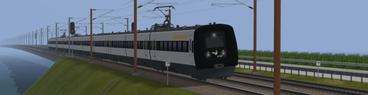

# Denmark 2024 objects

[![CC BY-NC-SA 4.0][cc-by-nc-sa-shield]][cc-by-nc-sa]

Blender models and textures for the [Denmark 2024 Open Rails route](https://github.com/pgroenbaek/openrails-route-dk24).

## License:

All models/textures in this repository named "PGA_\*" are made by Peter Grønbæk Andersen.

The "PGA_\*" models/textures are licensed under [CC BY-NC-SA 4.0](https://creativecommons.org/licenses/by-nc-sa/4.0/).

[![CC BY-NC-SA 4.0][cc-by-nc-sa-image]][cc-by-nc-sa]

## Credits:

Special thanks to:
- [Stefmiz](https://www.youtube.com/@stefmiz ) for his blender tutorials on YouTube (those were for Trainz but were very useful regardless).
- [Pete Willard](https://www.github.com/pwillard ) for maintaining the [Blender_MSTS_ORTS_Exporter](https://github.com/pwillard/Blender_MSTS_ORTS_Exporter ).

[cc-by-nc-sa]: http://creativecommons.org/licenses/by-nc-sa/4.0/
[cc-by-nc-sa-image]: https://licensebuttons.net/l/by-nc-sa/4.0/88x31.png
[cc-by-nc-sa-shield]: https://img.shields.io/badge/License-CC%20BY--NC--SA%204.0-lightgrey?style=flat&logo=creative-commons&logoColor=white